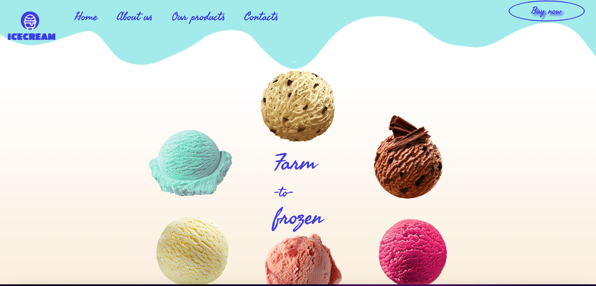
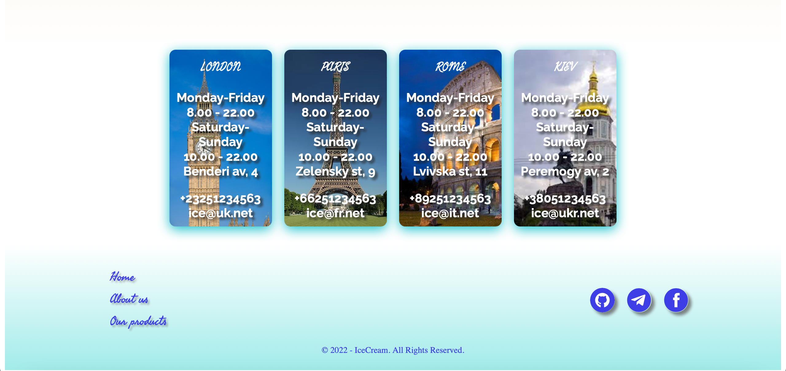

Individual project

Implemented routing, opening a modal window, a shopping cart and a request to the server on vanilla JS.

<h1 align="center">Ice cream app</h1>

Thanks to this application, you can choose and buy your favorite ice cream.

The header contains anchor links to go to the desired section, as well as the "Buy" button.

In the products section you can get acquainted with the types of ice cream, and by clicking on the button more, you can get acquainted with the products in detail

In the "Footer" section, anchor links and links to this promotion in social networks are also implemented

The application is fully responsive for mobile devices

<h2 align="left">The following technologies were used in the development of this application: HTML/SASS/JavaScript</h2>

